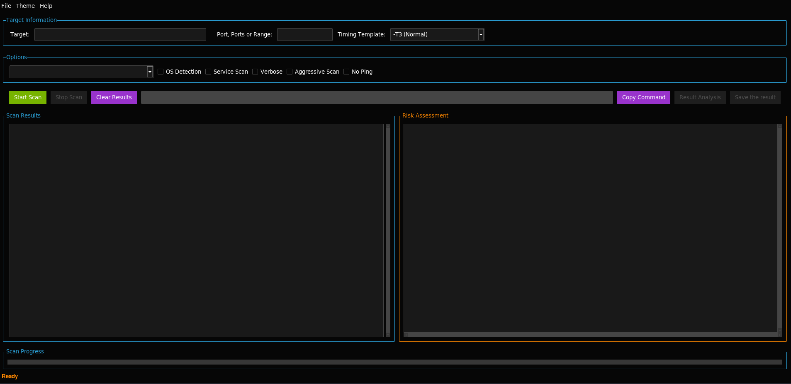

# NetRiskScanner: Features and Functionalities Explained

The **NetRiskScanner** is an advanced Python-based network scanning and risk assessment tool. Below is a detailed explanation of all its features and functionalities:

---

## 1. **Comprehensive Nmap Scanning**

The NetRiskScanner leverages the Nmap utility to perform advanced network scanning. It simplifies Nmap’s powerful functionalities through a graphical user interface (GUI).

### **Supported Scan Types**
- **Ping Scan (`-sn`)**: Quickly checks whether hosts in a network are active without scanning ports.
- **SYN Scan (`-sS`)**: Performs stealthy port scanning by sending SYN packets and analyzing responses. It does not complete the TCP handshake.
- **TCP Connect Scan (`-sT`)**: Establishes full TCP connections to detect open ports, useful when SYN Scan isn’t available.
- **UDP Scan (`-sU`)**: Detects open UDP ports by sending UDP packets and analyzing responses.
- **Null Scan (`-sN`)**: Sends packets with no flags to detect closed ports.
- **FIN Scan (`-sF`)**: Sends packets with only the FIN flag to detect closed ports.
- **Xmas Scan (`-sX`)**: Sends packets with FIN, PSH, and URG flags set to detect closed ports.
- **ACK Scan (`-sA`)**: Maps firewall rules by sending ACK packets.
- **Window Scan (`-sW`)**: Explores firewalls using TCP Window size.
- **IP Protocol Scan (`-sO`)**: Identifies supported IP protocols on a target.

### **Advanced Scanning Options**
- **OS Detection (`-O`)**: Identifies the operating system running on the target machine.
- **Service Scan (`-sV`)**: Detects the versions of services running on open ports.
- **Aggressive Scan (`-A`)**: Combines OS detection, service detection, and traceroute.
- **Disable Ping (`-Pn`)**: Skips host discovery and scans all provided targets.
- **Verbose Mode (`-v`)**: Provides detailed scan output in real-time.

These options are presented in dropdown menus and checkboxes, allowing users to customize scans easily.

---

## 2. **Real-Time Results Display**

### **Dual Panel Design**
- **Left Panel**: Displays live scan results as they are received. This allows users to monitor scans in real-time without waiting for the entire process to complete.
- **Right Panel**: Shows a detailed risk assessment based on the vulnerabilities identified during the scan.

### **Progress Tracking**
- **Progress Bar**: Provides a visual representation of scan progress. It updates dynamically as the scan progresses, giving users real-time feedback on the operation's status.
- **Status Bar**: Displays text-based status updates, such as “Scanning,” “Analysis Complete,” or error messages.

---

## 3. **AI-Powered Risk Assessment**

This feature uses Google’s Generative AI to analyze scan results and provide detailed risk assessments. The analysis includes:

### **How It Works**
1. **Input Parsing**:
   - Parses the Nmap output to identify open ports, running services, and their versions.
   - Uses vulnerability databases (e.g., CVE) to cross-reference findings.

2. **Risk Levels**:
   - Assigns severity scores to vulnerabilities (Low, Medium, High, Critical).
   - Categorizes risks for each service and port.

3. **Report Structure**:
   - **Executive Summary**: Highlights critical risks and provides a summary of scan findings.
   - **Identified Vulnerabilities**: Lists detailed descriptions of vulnerabilities and their impacts.
   - **Risk Levels Table**: Organizes findings in a table format for clarity:
     - Port
     - Service
     - Risk Level
     - Description
   - **Recommendations**:
     - Immediate actions (e.g., applying patches, configuring firewalls).
     - Short-term strategies (e.g., vulnerability scanning).
     - Long-term strategies (e.g., penetration testing).

4. **Dynamic Updates**:
   - The Risk Assessment section is automatically updated when analysis is complete.

---

## 4. **Dynamic Button Management**

### **State-Based Enable/Disable**
- **Analysis Button**: Disabled until a scan is completed.
- **Save Button**: Disabled until the Risk Assessment section contains valid data.
- **Clear Results Button**: Clears both scan results and risk assessments and disables dependent buttons.

This ensures that buttons are context-aware, reducing the chances of errors or unnecessary actions.

---

## 5. **Export and Save Options**

### **Exporting Results**
Users can save scan results and risk assessments to a `.txt` file for documentation and sharing.

### **Saving Risk Assessments**
- Users can save the Risk Assessment report to a `.txt` file.
- Includes a dialog box to specify file location and name.

---

## 6. **User-Friendly Command Display**

### **Command Builder**
- Displays the exact Nmap command being executed based on user inputs.
- Allows users to copy the command for use in a terminal or script.

---

## 7. **Error Handling and Validation**

### **Input Validation**
- Ensures that target IPs, domains, and port ranges are correctly formatted.
- Displays error messages if inputs are invalid.

### **Runtime Error Handling**
- Catches unexpected errors during scanning or risk analysis and provides detailed error messages.

---

## 8. **Customizable Themes**

### **Light and Dark Modes**
- Offers two themes:
  - **Cyborg** (Dark Mode): Ideal for low-light environments.
  - **United** (Light Mode): Provides high visibility in bright settings.

---

## 9. **Core Functionalities Explained**

### **Target Input Section**
- Accepts:
  - Single IP or domain.
  - IP ranges (e.g., `192.168.1.1-10`).
  - CIDR notation (e.g., `192.168.1.0/24`).

### **Scan Options Section**
- Dropdown menus and checkboxes simplify selecting scan types and advanced options.

### **Split Display Section**
- Results and risk assessments are displayed side-by-side for quick reference.
- Scrollbars ensure all content is accessible.

### **Clear Results Functionality**
- Clears both panels and disables dependent buttons.
- Resets the state of the application for a new scan.

---

## **Prerequisites**

Ensure the following are installed and set up on your system:

### **1. Python**
- **Python 3.8 or higher** is required. Download it from [Python Official Website](https://www.python.org/downloads/).

### **2. Nmap**
- Ensure Nmap is installed on your system. Download it from [Nmap Official Website](https://nmap.org/download.html).
- Verify installation by running:
    ```bash
    nmap --version
    ```

### **3. Required Python Libraries**
- The required Python libraries are listed in the `requirements.txt` file. They include:
  - `ttkbootstrap` for modern GUI components.
  - `tkinter` for core GUI functionalities.

---

## **Installation**

Follow these steps to set up and run the NetRiskScanner:

### **1. Clone the Repository**
```bash
git clone https://github.com/MustafaFBK/NetRiskScanner-Tool.git
cd NetRiskScanner
```

---

### **2. Install Python Libraries**
```bash
pip install --break-system-packages -r requirements.txt
```

---

### **3. Verify Nmap Installation**
```bash
nmap --version
```

# Usage

## 1. Launching the Tool

Run the tool with the command:
```bash
python NetRiskScanner.py
```

## **2. Configuring Scans**

Enter Target Information:

- Specify the target IP address, domain name, or CIDR range in the Target field.
- Optionally, specify a port range (e.g., 20-80) and spoof MAC address.
- Select Scan Type:
- Choose from the available scan types (e.g., SYN Scan, TCP Connect, UDP Scan) in the dropdown menu.
- Enable Advanced Options:
- Enable features like OS detection, service scan, verbose output, or disable ping.


## **3. Executing the Scan**

- Click the Start Scan button to begin scanning.
- Monitor the scan progress with the progress bar.
- View:
  -  Scan Results in the left panel.
  -  Risk Assessment in the right panel.


## **4. Exporting Results**

Save results by navigating to:

File > Export Results

## Export options:

- .txt (plaintext format)
- .json (structured format)

## Tool Structure :

### **1. Core Files :**

- Nmap_Main.py: Main application file for the GUI interface.
- utils: helper functions for Tool.
  - ```validator.py```: Validates target inputs like IP addresses, port ranges, and MAC spoofing.
  - ```nmap_runner.py```: Builds and executes Nmap commands.

### **3. Requirements**

```requirements.txt```: Contains all necessary Python dependencies.
